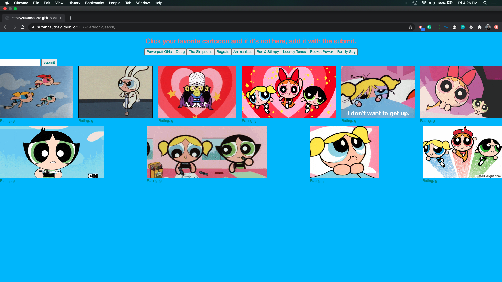

This is a fun program that uses the GIFY API.  It allows you to click on any cartoon and it will return 10 GIFs.  If you want to create your own GIFs than all you have to do is use the search for which GIFs you'd like to create. If the GIF is animated you must click on the GIF to start the animation and click on the GIF again if you wish to stop the animation. 

Link to deployed site: https://suzannaudra.github.io/GIFY-Cartoon-Search/

